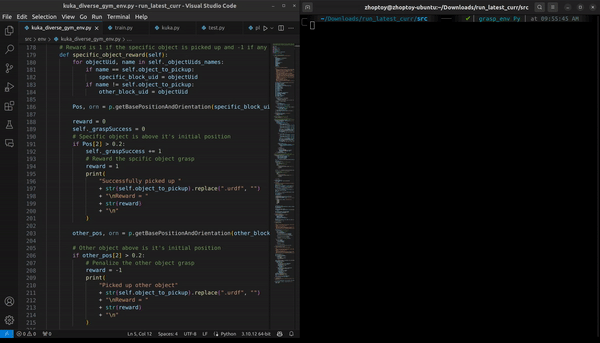

# RL-3D-Object-Manipulation-Grasping

## Selective Shape Manipulation in Reinforcement Learning for 3D Object Grasping

Welcome to the RL-3D-Object-Manipulation-Grasping repository! This project focuses on the implementation of Reinforcement Learning (RL) techniques for targeted 3D object top-down grasping with a specific emphasis on selective shape manipulation.

## Overview

This repository contains code, simulation setup scripts, training procedures, and experiment results aimed at developing a robust and adaptable robotic grasping system. The main emphasis lies in integrating state-of-the-art RL algorithms like Deep Q-Networks (DQN) and Deep Deterministic Policy Gradients (DDPG) to train the system.

## Project Highlights

- Integration of DQN and DDPG algorithms for adaptive grasping strategies
- Utilization of PyBullet simulation framework for testing and evaluation
- Detailed evaluation metrics including Success Ratio and training iterations
- Performance comparison between DQN and DDPG in grasping accuracy
- References to related research articles and literature in RL-based robotic manipulation

## Demo

Check out the demo video showcasing the project in action: [Demo.gif](Demo.gif).

## How to Use

To run or replicate the project:

1. Clone this repository.
2. Follow the instructions in each directory for specific functionalities.
3. Refer to documentation and README files within each sub-directory for detailed guidelines.

## Acknowledgments

Contributions from Abhishek Chauhan, Shreeprasad Sonar, and Vedang Wartikar on this project.

## References

Extensive references to related research articles and literature can be found in the `References` section of the project.

Feel free to explore the contents of this repository and contribute to further advancements in RL-based 3D object manipulation!

For any questions or suggestions, please contact the contributors.
